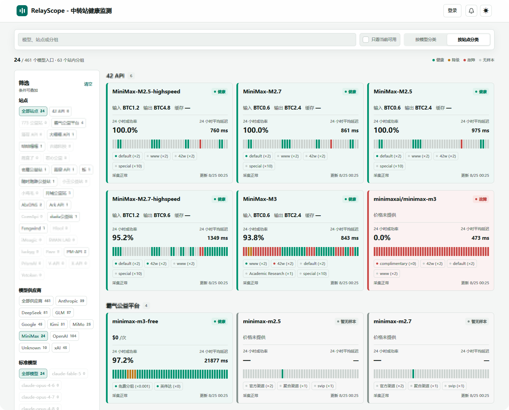

# RelayPulse

**English** | [中文](README.md)


RelayPulse is a lightweight, aggregated model-health monitoring system for AI API relay sites.

It collects: status pages, model markets, per-group availability, model catalogs, and pricing data. It does **not** call paid models to probe them; it keeps a short rolling history, preserves every site's original model and group names, and presents a unified cross-site view.

[](https://github.com/jzcangshu/RelayPulse/actions/workflows/ci.yml)
[](LICENSE)

## Why RelayPulse

Existing uptime tools (Uptime Kuma, Gatus) monitor HTTP endpoints but don't understand **models**. LLM gateways (LiteLLM, Helicone) observe your own traffic but can't compare sites you haven't routed through them. RelayPulse fills the gap between:

| Question | RelayPulse answers it by |
|---|---|
| "Which site currently serves model X?" | Reading each site's own status/market data, per model and per group |
| "Is site Y usable right now?" | Cross-model view with service state vs. collection state kept independent |
| "At what cost?" | Pricing captured alongside health, without making any paid API call |

It distinguishes **service health** (healthy / degraded / failed / no_samples) from **acquisition health** (fresh / stale / collecting / login_expired / challenge_pending), so a collection failure never masquerades as a service outage.



## Features

- **Passive collection** — reads data sites already publish; no synthetic probes, no model-call spend.
- **Model-level granularity** — monitor by canonical model family, site, raw model name, and site group.
- **Adapter system** — NewAPI, Sub2API, Uptime Kuma, model-market, and custom probe protocols. Adding a probe variant is one constructor call.
- **Encrypted credential vault** — authenticated sites' tokens and cookies stored with authenticated encryption; a Chrome extension imports sessions from a logged-in browser.
- **Cloudflare challenge recovery** — optional FlareSolverr integration for sites behind managed challenges.
- **Extreme lightweight** — one Go binary, one SQLite file (pure-Go driver, CGO-free). A 1-core / 768 MB VPS is suitable for RelayPulse alone at the default site count; see the [deployment sizing guide](docs/deployment-sizing.md) before enabling FlareSolverr or scaling site count.
- **Honest data** — an empty sample window is `no_samples`, never healthy or failed. No synthetic slots, no composite scores.

## Quick start

```bash
# From source (Go 1.26+)
make build
./bin/relaypulse
# → listening on http://127.0.0.1:8080

# Or with Docker
docker run -d -p 8080:8080 -v relaypulse-data:/app/data ghcr.io/jzcangshu/relaypulse:latest
```

On first run, RelayPulse generates a strong admin password and writes it to `<data-dir>/admin-password.txt` (mode 0600). The public dashboard is open; the admin console is at `/admin/`.

## Configuration

All configuration is via environment variables. Key ones:

| Variable | Default | Purpose |
|---|---|---|
| `RELAYPULSE_LISTEN_ADDR` | `127.0.0.1:8080` | Listen address |
| `RELAYPULSE_DATA_DIR` | `data` | SQLite database + admin password location |
| `RELAYPULSE_LOG_LEVEL` | `info` | Log level (debug/info/warn/error) |
| `RELAYPULSE_SHUTDOWN_TIMEOUT` | `10s` | Graceful shutdown deadline |
| `RELAYPULSE_PUBLIC_URL` | _empty_ | Canonical public URL (OAuth callbacks) |
| `RELAYPULSE_SESSION_ENCRYPTION_KEY` | _empty_ | Key for encrypting imported site sessions |
| `RELAYPULSE_FLARESOLVERR_ENDPOINT` | _empty_ | Optional FlareSolverr endpoint (loopback) |
| `RELAYPULSE_HTTP_CONCURRENCY` | `3` | Maximum concurrent site HTTP operations |
| `RELAYPULSE_COLLECTION_TIMEOUT` | `3m` | Per-site scheduled collection timeout |
| `RELAYPULSE_HTTP_TIMEOUT` | `20s` | Outbound HTTP client timeout |
| `RELAYPULSE_MAINTENANCE_INTERVAL` | `30m` | History cleanup interval |

See `docs/development.md` for the complete list and `deploy/relaypulse.env.example` for a template.

## Documentation

| English | 中文 |
| --- | --- |
| [Product Spec](docs/product-spec.md) | [产品规格](docs/product-spec.zh-CN.md) |
| [Architecture](docs/architecture.md) | [架构](docs/architecture.zh-CN.md) |
| [Data Contract](docs/data-contract.md) | [数据契约](docs/data-contract.zh-CN.md) |
| [Adapter Authoring](docs/adapter-authoring.md) | [适配器编写](docs/adapter-authoring.zh-CN.md) |
| [Operations](docs/operations.md) | [运维清单](docs/operations.zh-CN.md) |
| [Development](docs/development.md) | [本地开发](docs/development.zh-CN.md) |
| [Deployment Sizing](docs/deployment-sizing.md) | [部署容量指南](docs/deployment-sizing.zh-CN.md) |

## Adding monitoring sites

RelayPulse starts with an empty database. Add sites through the admin console (`/admin/`):

1. Choose an adapter and provide its configuration (the console renders a form from the adapter's JSON Schema).
2. Optionally import a login session for authenticated sites.
3. The scheduler begins collecting on the configured interval.

A `sites.example.json` is provided as a reference for the configuration format.

## Recommended server

| Deployment | CPU | RAM | Disk | Swap |
| --- | ---: | ---: | ---: | ---: |
| RelayPulse only | 1-2 vCPU | 1 GB | 10 GB free | 1-2 GB |
| With FlareSolverr | 2-4 vCPU | 4 GB | 20 GB free | 4 GB |

The 768 MB profile is suitable for RelayPulse alone at the default site count,
not for Chromium/FlareSolverr. See the [measured sizing guide](docs/deployment-sizing.md)
for capacity assumptions and expansion signals.

## Project status

RelayPulse is prepared for its first public release. Version tags publish the
CGO-free container image; review the operations checklist before deployment.
See [CHANGELOG.md](CHANGELOG.md) for the release history.

## License

[MIT](LICENSE) — RelayPulse contributors.

## LinuxDo 社区

<div align="center">
  <a href="https://linux.do" target="_blank">
    
  </a>
  <p>
    <a href="https://linux.do" target="_blank"><strong>LinuxDo 社区</strong></a><br>
  </p>
    <p>@蕉灼の仓鼠</p>
    <p>本人长期活跃于L站;</p>
    <p>这里的人很好说话又好听;</p>
    <p>欢迎都来加入L站大家庭。 </p>

</div>
