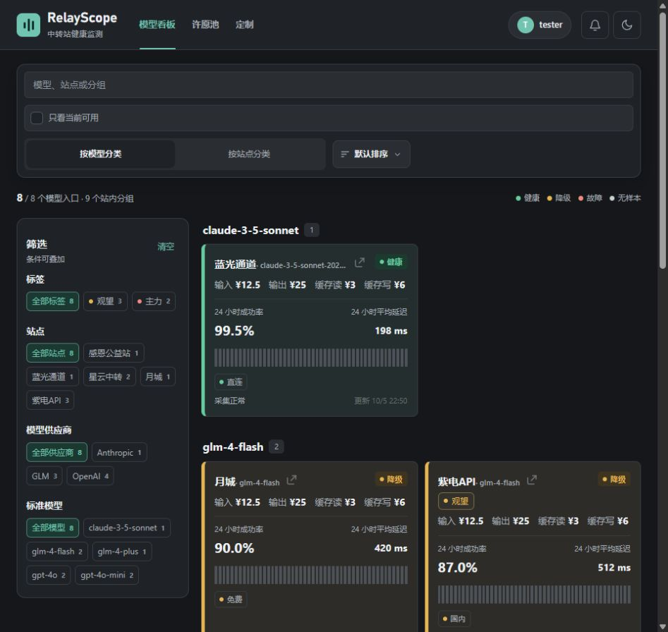
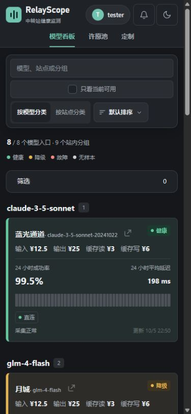

# 2026-10-05 修复结果

修复位于 codex/review-remediation（审查修复分支），以已有路由观测分支 adb529e 为基线，保留主分支及原有分支。当前改动尚未提交、推送或部署。没有删除文件，也没有发送真实通知或进行真实退款。

## 范围落实

| 原审查事项 | 结果 |
| --- | --- |
| 登录回调来源绑定 | 绑定短期浏览器凭据，校验过期、重放与不同浏览器；安全属性兼容公开回调地址 |
| 看板失败不重试 | 完整快照成功应用后才提交版本；失败可见、可重试，保留已有数据 |
| 详情错配 | 新请求使旧请求失效，关闭后响应不再写入，网络错误结束加载状态 |
| 免费额度与入账不一致 | 资格核验、发放扣减、订单入账、达标更新同一事务，失败回滚 |
| 公告修改不推送 | 完整内容版本去重，标题与长文尾部编辑可形成新版本，保留旧队列状态 |
| 取消订阅失败仍成功 | 统一检查响应，失败不提示已取消 |
| 发布缺少门禁 | 复用同一提交检查，主分支来源校验，成功后才推送镜像 |
| 构建上下文带入敏感文件 | 排除部署凭据记录、带后缀及嵌套环境文件 |
| 手机导航与通知不可用 | 保留导航，通知使用可关闭抽屉并管理焦点与背景交互 |
| 中宽工具栏越界 | 按内容容器宽度重排，通知覆盖展示，不再挤压工具栏 |
| 单站公告筛选状态 | 按用户最新要求取消卡片公告入口，清理不可到达的单站路径；保留全局通知与时间筛选 |
| 会员退款规则 | 旧权益不回算；新订单撤销尚未使用的贡献区间，保留其他续费、兑换、预登记与赠送 |
| 筛选区占屏 | 手机默认折叠并显示已选数量；有结果与已选项优先，大列表提供局部搜索 |
| 基础尺度与动效 | 共享控件尺度，合并重复样式；宽屏稳定分栏、中窄屏覆盖抽屉，保留阅读位置 |
| 卡片动作 | 移除用户不需要的公告按钮；标题与主体统一进入详情，公告从顶栏查看；站名优先完整显示 |
| 可维护性 | 请求轮询、偏好同步、订阅传输拆为独立可测试职责；清理失效样式与无入口代码 |
| 格式门禁 | 已格式化不规范的后端文件，最终格式检查无输出 |
| 历史清理与续费提醒等既有分支修复 | 已作为本修复分支基线纳入完整测试，不重复实现 |

用户明确排除的“加深状态小字、减少重复染色”没有实施。健康/降级文字色、徽标字号、卡片底色与粗左边框保持不变，看板原样式文件无修改。

## 公告防重复边界

- 相同公告完整内容版本按订阅去重，重复采集与重复回调不会新增队列消息。
- 已见内容回退不重推；首次历史回填静默；升级不将现有公告误判为新消息。
- 站点改名不改变新版本身份，旧消息兼容比较排除站名；站名本身包含分隔符也有回归覆盖。
- 原队列编号、待发/已发/失败/重试状态、次数与时间完整保留，不重置旧消息。
- 旧消息只保存截断正文，无法恢复完整历史内容时采用保守去重，优先避免疑似历史重推。新版本之间的长文尾部编辑可以正常推送。
- 前端收到通知更新仅显示未读提示，不自动弹开面板打断阅读。

本地版本记录表示已经采集过，不等于外部平台已经送达。平台接收后回执丢失，或发送成功但本地状态尚未写入时进程崩溃，原重试机制仍存在重复的可能；本次没有承诺外部平台严格只送达一次。此次去重修复不扩大这一既有风险。

## 退款恢复

新订单来源区间只撤销退款时尚未使用的部分，后续订单等量前移，其他权益间隙保留。管理员缩短到期后再次延长，不会恢复已裁剪的旧订单贡献。

平台退款先持久化占用：明确业务拒绝可重试，超时或结果不明不自动再次转账。后台新增“登记已退款”，仅在管理员明确确认平台已完成退款后登记本地状态，不再次调用平台。旧订单按照用户意见不做人工核对或历史回算；没有来源区间的旧会员订单不支持自动退款。

## 验证

- 全部后端测试、后端静态检查通过，包含已纳入的路由观测分支。
- 前端与扩展合计 90 项测试通过，其中公开页 68 项、后台 19 项、扩展 3 项。
- 主程序构建、后端格式检查、变更空白检查通过。
- 发布工作流专用静态检查通过；未实际触发发布。
- 四篇决策笔记格式检查通过；本次新增文本与代码的常见凭据模式扫描无命中。
- 独立代理完成需求符合性与代码质量复核，并修复两轮公告去重边界、退出后的偏好晚响应、隐藏看板缩窗锁定等回归。
- 浏览器使用本地模拟会员数据，实测 390、760、962、1600 像素宽度，深浅主题、手机筛选展开、通知关闭与焦点返回、定制页切换后缩窗导航。真实支付与推送使用模拟器测试，未对真实账户操作。
- 本地没有执行竞态检测；发布复用的持续集成仍运行后端竞态检测。后台恢复按钮经过行为测试，未在真实支付平台点击。

## 界面对照

| 修改前 | 修改后 | 目的 |
| --- | --- | --- |
| 手机隐藏导航、铃铛展开无内容 | 导航保留、通知抽屉可见且可退出 | 核心入口可用 |
| 工具栏被右栏挤压越界 | 工具栏按容器重排，中窄屏通知覆盖 | 控件完整且阅读位置稳定 |
| 手机首屏几乎全是筛选 | 筛选默认折叠，首屏展示模型结果 | 信息优先级清晰 |
| 长模型名挤掉站名 | 站名优先，副标题弹性缩略 | 优先辨认监测对象 |
| 卡片公告按钮增加视觉噪声 | 按用户要求移除，顶栏统一查看通知 | 保持卡片简洁 |

本地模拟预览暂保留在 http://127.0.0.1:18099（本机模拟服务），方便继续查看。本次构建缓存位于 .cache/review-remediation（修复验证缓存），工具还使用了已有后端与包管理器缓存；依照用户要求均未删除，可在不再需要时手动清理。
