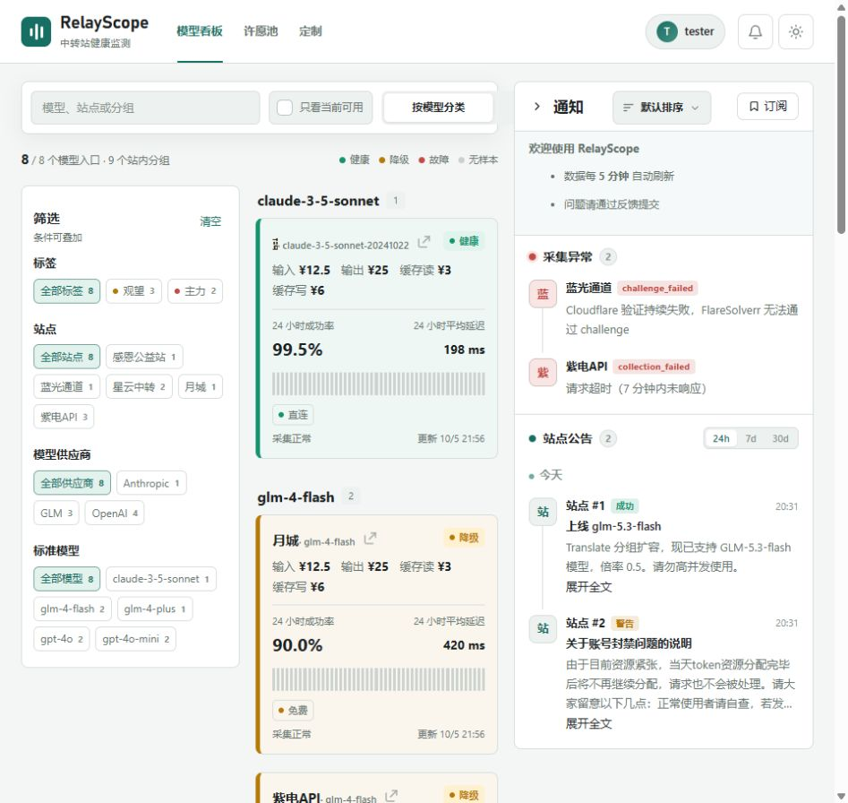
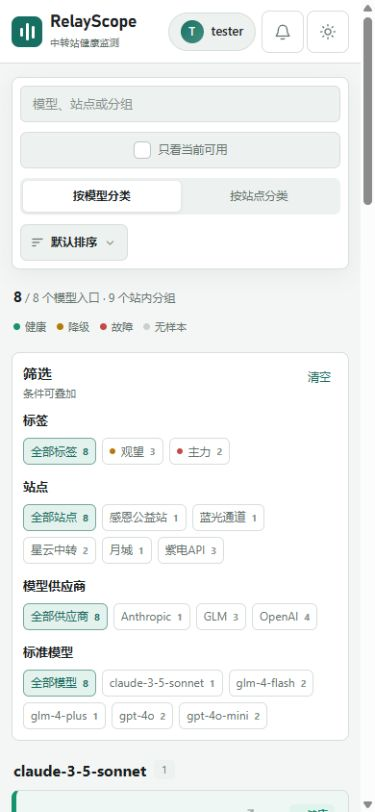

# 2026-10-05 代码质量与界面审查

> 本文保留初次审查证据；后续修复与用户取舍见同目录 remediation.zh-CN.md（修复结果）。

## 范围与结论

审查基线为 main（主分支）提交 04a864e。三位子代理分别审查后端、架构与工程门禁、界面设计；主代理复核关键证据并运行检查、检查真实页面。

项目的模块化单体与静态前端交付方式仍然适合当前规模，不建议为了本次整理更换框架。当前更值得投入的是登录安全、失败恢复、事务边界与响应式布局。测试通过不能代表这些路径已经覆盖。

本次修改仅涉及分支本地元数据与本审查报告、截图，没有修改业务代码、提交、推送、合并或删除文件。下列问题仍待修复。

## 分支与工作区整理

| 对象 | 核实结果 | 处理 |
| --- | --- | --- |
| main（主分支） | 04a864e，与 origin/main（远程主分支）一致 | 保持当前分支 |
| codex/ui-experience-refresh（界面刷新分支） | 3ca3641，已完全合入主分支 | 改名为 codex/archive/ui-experience-refresh（归档界面刷新分支），保留所有提交 |
| codex/routing-observations（路由观测分支） | adb529e，与对应远程一致，比主分支领先 6 个提交，没有分叉 | 保留并添加待审查说明，未自动合并 |
| 工作目录 | 仅一个工作目录；开始审查时无未提交改动 | 结束时仅新增审查报告与两张截图 |

已执行远程引用更新，没有清除远程分支。路由观测分支累计涉及 40 个文件、约 2490 行新增与 179 行删除；不能将它视为一个普通小补丁直接合入。

该分支还包含历史清理、续费提醒重复发送、非标准计价阶梯修复。这些是“主分支尚未接收、分支已有实现”的事项，不应另起一套重复修复。新增路由接口、存储、适配器和证书校验配置已做静态抽查，但没有运行该分支完整测试，也没有给出可直接合并的结论。

## 优先修复的问题

以下位置均相对项目根目录，行号对应上述主分支基线。高优先级表示建议先处理，中优先级表示有明确影响但通常依赖特定操作或故障条件。

### 1. 高优先级：登录回调未绑定发起浏览器

- 位置：internal/linuxdo/oauth.go（第三方登录服务）第 62–78 行；internal/httpserver/routes.go（路由注册）第 99–109 行。
- 证据：登录随机值只存放在服务器全局映射；发起流程没有设置浏览器绑定凭据，回调也只接收授权码与随机值。
- 影响：攻击者发起自己账户的授权，保留未消费回调，再诱导他人打开，可将他人的浏览器登录到攻击者账户。后续保存的通知目标或充值可能落到错误账户。这里不是读取受害者已有账户，而是强制切换登录身份。
- 建议：用短期浏览器凭据绑定登录随机值，在回调同时验证并一次性消费；补充不同浏览器不能消费同一登录流程的测试。
- 验证：跨文件静态核实；没有在真实身份提供方发起攻击测试。路由观测分支同样存在。

### 2. 高优先级：看板加载失败后，同版本轮询不再重试

- 位置：web/public/dashboard.js（公开看板脚本）第 945–953 行。
- 证据：面板请求成功前就保存元信息中的版本号。面板请求失败后异常被静默吞掉，下一次看到相同版本便提前返回。
- 影响：首次打开可能一直显示读取状态；已经打开的页面可能停留在旧数据，直到服务端版本再次变化。
- 建议：完整快照成功接收并应用后才提交版本号；首次失败提供重试入口，已有数据保留并标明更新失败。
- 验证：在内存中执行真实函数，连续两轮调用只有“元信息、失败的面板请求、元信息”，缺少第二次面板请求。

### 3. 高优先级：模型详情慢响应可覆盖另一模型

- 位置：web/public/dashboard.js（公开看板脚本）第 1202–1232 行。
- 触发：先打开甲模型，再关闭并打开乙模型，甲请求较慢且最后返回。
- 影响：标题和站点显示乙，正文却展示甲的分组与详情，监控数据身份被混淆。
- 建议：引入请求序号或取消旧请求，只允许当前详情请求写入界面；关闭后旧响应也不得继续渲染。
- 验证：内存执行实际函数复现“乙标题、甲正文”。

### 4. 中优先级：免费额度扣减与助力入账缺少共同事务

- 位置：internal/httpserver/user_routes.go（用户路由）第 252–274 行；internal/store/wish_credits.go（许愿额度存储）的额度扣减事务。
- 证据：先提交额度扣减，再分别创建免费订单和标记支付。后两步出错、请求取消或进程中断时，没有回滚已扣额度。
- 影响：额度减少，却没有相应的成功助力记录。
- 建议：把免费额度扣减、订单创建、入账与达标更新作为一个存储事务；真实支付部分单独定义失败补偿语义。
- 验证：静态核实事务边界，没有故意中断运行中的真实业务。路由观测分支同样存在。

### 5. 中优先级：已推送公告的修改不会再次入队

- 位置：internal/store/announcements.go（公告存储）第 108–110 行；internal/store/notifications.go（通知存储）第 12 行；internal/store/migrations/007_announcements.sql（公告迁移）第 45 行。
- 证据：内容变化返回新事件但沿用公告编号；待发队列按“订阅编号＋公告编号”唯一约束去重，冲突时忽略。
- 影响：同一公告第一次入队后，后续修改无法形成新通知；已发送记录不会更新为新内容重新发送。
- 建议：为内容版本建立事件身份，让队列按版本去重，并把标题纳入变更识别。
- 验证：内存数据库插入已发送原文后，再插入同编号修改稿，仍仅有原始已发送记录。路由观测分支同样存在。

### 6. 中优先级：取消订阅失败仍显示成功

- 位置：web/public/dashboard.js（公开看板脚本）第 2671–2674 行。
- 证据：单站取消订阅没有检查响应状态，接口返回未登录或服务器错误时仍提示“已取消订阅”。
- 影响：用户以为已经停止通知，实际订阅仍保留。
- 建议：统一请求失败处理，只在服务端确认成功后提示成功；与已有批量取消行为保持一致。
- 验证：模拟服务器返回 500（服务器错误），真实函数仍显示成功提示。

### 7. 中优先级：发布流程可以跳过检查直接发布

- 位置：.github/workflows/release.yml（发布流程）第 11–48 行；Dockerfile（容器构建文件）第 15 行。
- 证据：标签触发独立构建与推送；持续集成只监听主分支推送与合并请求，发布任务没有等待同一提交通过测试；容器构建本身也不运行测试。
- 影响：给未通过检查的提交打发布标签，仍可发布并覆盖最新版镜像。
- 建议：复用同一检查流程，让发布依赖同一提交全部检查成功；明确允许发布的提交来源。
- 验证：静态配置核实，没有触发发布。

### 8. 中优先级：本地敏感部署文档未排除出容器构建上下文

- 位置：.dockerignore（容器忽略配置）；Dockerfile（容器构建文件）第 14 行；.gitignore（版本库忽略配置）末尾。
- 证据：版本库忽略规则明确将 DEPLOYMENT.md（含凭据的生产部署记录）排除，该文件本地确实存在；容器忽略规则没有排除它，构建使用全目录复制。环境文件规则也只覆盖以 .env（环境配置）结尾的形式，未覆盖 .env.production（生产环境配置）等后缀形式。
- 影响：从本地目录构建时，敏感文件可能进入构建上下文和中间构建层；使用远程构建器时还会被上传。不能因此断言最终运行镜像已泄露，因为最终阶段仅复制二进制。
- 建议：同步敏感文件排除规则，或改为明确列出构建所需源码。报告未读取或记录凭据内容。

## 界面实测与打磨

经用户允许，在内置浏览器打开项目自带模拟服务，使用模拟会员数据。检查当前公开页深浅主题、通知侧栏、定制显示页与通知订阅页，覆盖 390、约 962、1440 像素宽度。后台样式为代码审查，没有运行后台登录流程；模拟服务不能证明真实登录、支付和推送行为。

### 9. 中优先级：手机导航与通知入口不可用

- 位置：web/public/shell.css（外壳样式）第 290、300 行；web/public/dashboard.css（看板样式）第 1743 行。
- 实测：390 像素宽度不显示主导航；点击通知后按钮状态变为展开，但通知侧栏仍不可见。641–800 像素范围还单独隐藏定制入口。
- 建议：手机保留可访问的导航菜单，通知采用抽屉或独立面板。入口不能仅凭隐藏内容来实现适配。

### 10. 中优先级：中等宽度下工具栏越界

- 位置：web/public/dashboard.css（看板样式）第 118–120、491–494、605–608、1687–1689 行。
- 实测：约 962 像素宽度打开通知，分类控件被遮挡，排序按钮出现在通知栏头部范围，站点名也被压缩得难以辨认。
- 原因：通知占用固定 340 像素，工具栏仍保留四列及搜索、分类的最小宽度；布局只在整个窗口低于 800 像素时重排，未按内容区域实际宽度适配。
- 建议：按内容容器宽度折行，搜索独占首行；中窄窗口通知使用覆盖抽屉。

### 11. 中优先级：单站通知筛选在切换时间范围后失效

- 位置：web/public/dashboard.js（公开看板脚本）第 3198–3203、1067–1071 行。
- 证据：进入单站公告仅临时替换数据数组，渲染后立即恢复全站数据；时间范围切换再次使用全站数据，标题却仍停留在该站。
- 建议：把当前站点与时间范围作为明确筛选状态统一渲染，并提供返回全部通知入口。此项为静态核实。

### 视觉与交互优化顺序

1. **压缩筛选区，优先露出结果。** 手机 390×844 的首屏几乎被工具栏与筛选占满，第一张模型卡片刚刚露出。筛选改成带已选数量的折叠面板，默认显示有结果与已选项；大列表增加局部搜索。位置：看板脚本第 708–720 行，看板样式第 1085、1745–1763 行。
2. **加深状态小字，减少重复染色。** 健康徽标文字对比度约 3.36∶1，降级约 3.24∶1，浅灰计数对白约 3.21∶1；11 像素小字应达到通常的 4.5∶1要求。将状态文字色与色块色分开，保留清晰徽标与状态条，弱化整卡底色和粗左边框的重复强调。位置：看板样式第 10、14–17、1071–1074、1343–1359 行。数值来自样式颜色计算，不是截图采样。
3. **统一基础尺度，保留页面密度差异。** 公开页、定制页、后台分别使用不同正文尺度、圆角与同义颜色。提取共享的语义色、文字层级、圆角、控件高度和焦点规则；后台可以更紧凑，但同种按钮、标签应有一致手感。位置：看板样式第 22–27、1239 行；外壳样式第 177 行；web/admin/base.css（后台基础样式）第 3–30、66 行。
4. **通知展开保持阅读位置稳定。** 当前同时改变容器最大宽度、列宽和间距，整个卡片区域随之重排。宽屏稳定分栏，中窄屏采用覆盖抽屉；以透明度与位移为主要动效，关闭恢复按钮焦点，尊重减少动态效果设置。位置：看板样式第 115–121 行。已确认重排实现及布局变化，未进行帧率性能测量。
5. **让标题行为可预期。** 卡片主体进入详情，但有公告时标题会改为打开公告，普通文字节点也没有独立键盘入口。标题统一进入详情，公告放单独按钮，官网链接与公告入口使用清晰、一致的悬停和按压反馈。位置：看板脚本第 754–758、914–934 行。

截图均为模拟数据，不代表线上真实健康状态：

## 需要明确的业务规则

会员直充订单退款后，当前只更新订单状态，不撤销此前增加的会员期限。位置：internal/store/ldc_orders.go（订单存储）第 165–196 行，internal/httpserver/admin_membership.go（后台会员管理）第 249–271 行。

这一行为已静态确认，但“退款是否保留权益”需要产品规则才能最终定性。若退款意味着撤销对应权益，应使用权益流水计算剩余期限，避免简单减天数误伤后续续费与赠送；若有意保留，后台退款确认应明确说明。现有测试未覆盖会员退款后的期限。

## 可维护性建议

公开页脚本约 3204 行、130 个函数，混合轮询、详情、账户、偏好同步、通知、支付与许愿状态。优先提取请求与轮询状态、偏好同步、订阅管理三个职责边界；先减少共享可变状态和重复失败处理，不必全面迁移框架。

现有前端测试包含有效的行为测试，也依赖源码文本匹配和提取函数执行。后者容易在整页初始化、异步竞态、响应式交互上留下盲区。模块提取后直接测试导出行为，并补少量整页场景：同版本请求失败恢复、快速切换详情、取消订阅失败、手机通知入口与中宽侧栏布局。

## 检查结果与限制

| 检查 | 结果 |
| --- | --- |
| 全部后端测试 | 通过；部分结果使用已有测试缓存 |
| 后端静态检查 | 通过 |
| 前端现有测试 | 72 项全部通过 |
| 公开页、后台脚本语法检查 | 通过 |
| 主程序构建 | 通过 |
| 后端格式检查 | 未通过，8 个文件需要格式化 |
| 当前页面视觉验证 | 本地模拟服务，公开页与定制页，深浅主题和多宽度 |
| 路由观测分支 | 静态抽查；未运行该分支完整测试 |
| 并发竞争检测、真实支付、真实推送、线上后台 | 本次未执行 |

格式检查涉及：internal/adapter/modelstatus_test.go（模型状态测试）、internal/httpserver/sessionimport_test.go（会话导入测试）、internal/notifier/bark.go（推送实现）、internal/pricing/pricing_test.go（计价测试）、internal/session/allapihub_test.go（会话集成测试）、internal/session/provider.go（会话提供器）、internal/session/provider_test.go（会话提供器测试）、internal/store/announcements_test.go（公告存储测试）。本次没有自动格式化，避免把审查记录混入业务改动。

## 后续处理顺序与本地残留

建议先修复登录绑定、轮询恢复、详情竞态；随后处理额度事务、公告版本去重、取消订阅失败与发布门禁，再完成响应式与视觉尺度统一。路由观测分支中的既有修复需单独验证后整合。

依照用户约定没有删除缓存或旧构建文件。本次构建输出位于 .cache/review-2026-10-05（本次验证缓存），可在不再需要后手动删除。此前还存在 .cache（缓存）、bin（构建目录）、dist（发布目录）、根目录旧可执行文件与测试数据库伴随文件；本次没有判定它们全部可删除，也没有移动可能包含部署信息的文件。
